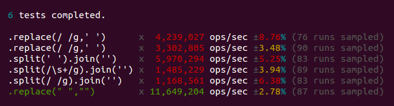

# JSPerf for NodeJS

This command line utility helps you run performance tests from http://jsperf.com locally with NodeJS.

## Installation

```sh
npm install jsperf -g
```

## Warning

**The tool runs the code fetched from jsperf.com w/o any processing. This can be very dangerous. Review the tests before running or use a disposable sandboxes**

This also means that browser-dependant tests will not run (at least with the current version). Fetch only pure JS tests.

## Usage

Create a folder for your local tests:

```sh
mkdir my-jsperf-tests
```

Initialize your tests:

```sh
cd my-jsperf-tests
jsperf init
```

Get a test:

```sh
jsperf get replace-vs-split-join-vs-replaceall 67
```

Preview a test:

```sh
jsperf preview replace-vs-split-join-vs-replaceall 67
```

Run a test:

```sh
jsperf run replace-vs-split-join-vs-replaceall 67
```

Results:



## License

[LICENSE](LICENSE)
